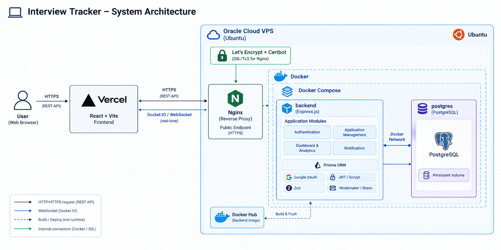

# Interview Tracker

Interview Tracker là ứng dụng web hỗ trợ sinh viên và người tìm việc quản lý quá trình ứng tuyển. Người dùng có thể theo dõi trạng thái từng đơn ứng tuyển, trực quan hóa tiến độ bằng Dashboard và nhận thông báo nhắc nhở các công việc cần thực hiện.

## 🌐 Live Demo

- Link: https://interview-tracker-khaki.vercel.app

## 🧭 Overview

- Quản lý toàn bộ quá trình ứng tuyển tại một nơi.
- Theo dõi trạng thái ứng tuyển bằng Kanban Board.
- Dashboard thống kê số lượng đơn, tỷ lệ phỏng vấn, tỷ lệ Offer,...
- Hệ thống thông báo nhắc nhở theo thời gian thực.
- Xác thực người dùng bằng JWT.

## 🏗️ System Architecture



## ✨ Features

- User Authentication (Register, Login, Forgot Password, Reset Password)
- Application Management (CRUD)
- Kanban Board (Drag & Drop)
- Dashboard Analytics
- Notification System
- Responsive UI

## 💻 Tech Stack

| Layer | Technology |
|--------|------------|
| Frontend | React, Vite, Tailwind CSS, Axios, Zustand, React Router |
| Backend | Node.js, Express.js |
| Database | PostgreSQL (Neon), Prisma ORM |
| Authentication | JWT, Bcrypt |
| Validation | Zod |
| Email | Brevo SMTP (Nodemailer) |
| Analytics | Google Analytics 4 |
| Deployment | Vercel, Railway, Neon |

## 📦 Project Structure

```text
Interview_Tracker/
├── backend/
│   ├── src/
│   ├── prisma/
│   └── README.md
├── frontend/
│   ├── src/
│   └── README.md
└── README.md
```
For more details:

- 📁 Backend: [`/backend`](./backend)
- 📁 Frontend: [`/frontend`](./frontend)

## 🔌 API Overview

### Authentication

- Register
- Login
- Forgot Password
- Reset Password

### Applications

- Create Application
- Update Application
- Delete Application
- Update Status
- Get Applications

### Dashboard

- Dashboard Statistics
- Analytics

### Notifications

- Get Notifications
- Mark as Read
- Real-time Notification

## 🚀 Future Improvements

- Google OAuth Login
- Email Verification
- Refresh Token
- AI Resume Analysis
- AI Interview Preparation
- Company Insights
